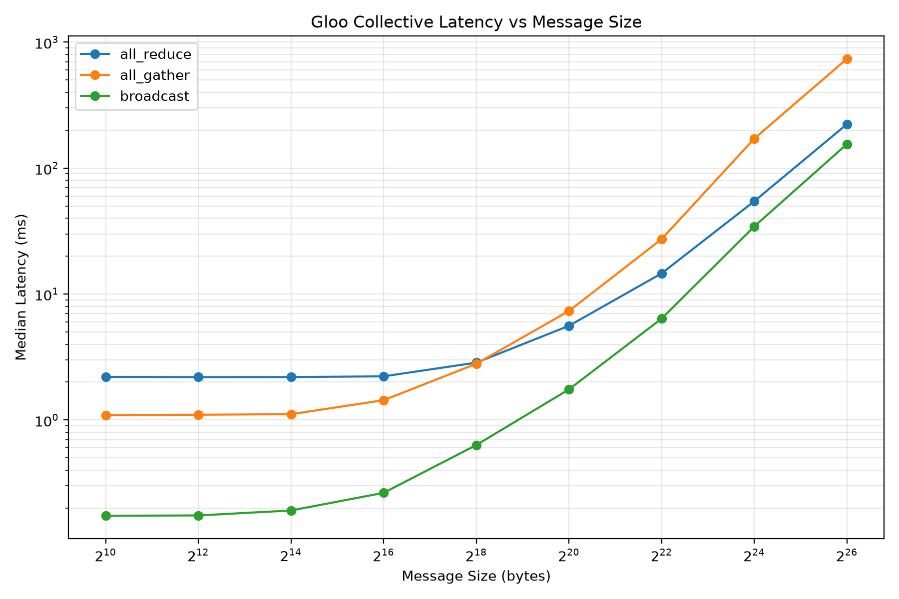
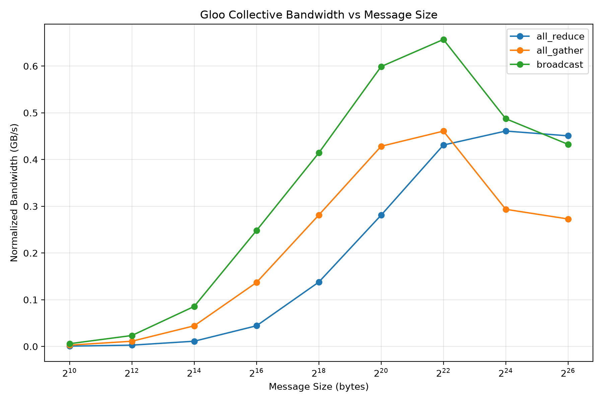

# Distributed Collectives Benchmark

A local CPU benchmark for exploring the latency and communication behavior of PyTorch distributed collective operations.

The project launches four local processes with `torch.multiprocessing`, initializes a PyTorch Distributed process group using the Gloo backend, and benchmarks:

* `all_reduce`
* `all_gather`
* `broadcast`

Each collective is measured across message sizes from **1 KiB to 64 MiB**. The benchmark records latency statistics, exports the results to CSV, calculates normalized communication bandwidth, and generates latency and bandwidth plots.

This project intentionally uses **CPU + Gloo**. It does not claim GPU cluster or NCCL benchmark experience. The goal is to understand collective communication behavior locally and connect those observations to how GPU-oriented communication systems such as NCCL differ.

---

## Results

The benchmark was run with four local processes, 5 warm-up iterations, and 20 measured iterations for each operation/message-size pair.

### Latency vs. Message Size



The measurements show two broad performance regimes.

For small messages, fixed communication and coordination overhead dominate. For example, median `all_reduce` latency remained almost unchanged:

| Message Size | Median `all_reduce` Latency |
| -----------: | --------------------------: |
|        1 KiB |                    2.201 ms |
|        4 KiB |                    2.191 ms |
|       16 KiB |                    2.193 ms |
|       64 KiB |                    2.223 ms |

Increasing the payload by 64× from 1 KiB to 64 KiB barely changed the observed latency.

As message sizes increase beyond this range, transfer cost becomes increasingly significant:

| Message Size | `all_reduce` | `all_gather` | `broadcast` |
| -----------: | -----------: | -----------: | ----------: |
|      256 KiB |     2.855 ms |     2.796 ms |    0.633 ms |
|        1 MiB |     5.599 ms |     7.344 ms |    1.751 ms |
|        4 MiB |    14.597 ms |    27.307 ms |    6.385 ms |
|       16 MiB |    54.595 ms |   171.500 ms |   34.426 ms |
|       64 MiB |   223.333 ms |   738.004 ms |  155.158 ms |

The transition begins around the **64–256 KiB** region and becomes especially clear by 1 MiB. This is the characteristic shift from a latency-dominated regime toward a bandwidth-dominated regime.

---

## Normalized Bandwidth



Raw `message_size / latency` is not directly comparable across different collective operations because the communication patterns are different.

The project therefore calculates a normalized transfer volume for a per-rank payload of size `S` and world size `n`:

| Collective   | Normalized Transfer Volume |
| ------------ | -------------------------: |
| `all_reduce` |         `S × 2(n - 1) / n` |
| `all_gather` |              `S × (n - 1)` |
| `broadcast`  |                        `S` |

Normalized bandwidth is then calculated as:

```text
normalized bandwidth =
    normalized transfer bytes / elapsed time
```

and reported in decimal **GB/s**.

For this representative run, normalized bandwidth increased as larger messages amortized fixed communication overhead. Approximate peak values were:

| Collective   | Approx. Peak | Message Size |
| ------------ | -----------: | -----------: |
| `broadcast`  |   0.657 GB/s |        4 MiB |
| `all_gather` |   0.461 GB/s |        4 MiB |
| `all_reduce` |   0.461 GB/s |       16 MiB |

At the largest payloads, some curves flatten or decline rather than continuing upward. In particular, `all_gather` becomes substantially more expensive at 16–64 MiB.

This benchmark does not attempt to isolate a single cause for that decline. At these sizes, CPU execution, process scheduling, memory traffic, buffer sizes, and the local communication backend can all influence the measurement.

---

## Benchmark Methodology

The benchmark uses the following configuration:

| Setting                | Value                                   |
| ---------------------- | --------------------------------------- |
| Backend                | Gloo                                    |
| Device                 | CPU                                     |
| Processes / world size | 4                                       |
| Tensor dtype           | `float32`                               |
| Warm-up iterations     | 5                                       |
| Measured iterations    | 20                                      |
| Smallest message       | 1 KiB                                   |
| Largest message        | 64 MiB                                  |
| Collectives            | `all_reduce`, `all_gather`, `broadcast` |

Before every measured collective, all ranks enter a distributed barrier.

```text
rank 0 ─────┐
rank 1 ─────┤
rank 2 ─────┼── barrier
rank 3 ─────┘
             │
             ▼
        start timer
             │
             ▼
       collective op
             │
             ▼
         stop timer
```

The barrier itself is outside the timed section. This reduces timing skew caused by ranks reaching the operation at different moments.

Each process records its local elapsed time using `time.perf_counter()`.

After the measured iterations finish, the latency arrays are gathered to rank 0. For every iteration, the benchmark uses the **slowest rank's elapsed time** as the collective latency:

```text
iteration latency =
    max(rank 0, rank 1, rank 2, rank 3)
```

The benchmark then records:

```text
mean
median
minimum
maximum
```

The plots use **median latency**, which reduces the effect of occasional scheduling or system-load outliers.

---

## Collective Operations

### AllReduce

Each rank contributes a tensor, the values are reduced using `SUM`, and every rank receives the final reduced tensor.

For the four-process demo:

```text
rank 0 -> 1
rank 1 -> 2
rank 2 -> 3
rank 3 -> 4

1 + 2 + 3 + 4 = 10

rank 0 -> 10
rank 1 -> 10
rank 2 -> 10
rank 3 -> 10
```

Run the minimal demo with:

```bash
python scripts/run_all_reduce.py
```

### AllGather

Each rank contributes its local tensor and receives the tensors contributed by all ranks.

With four processes and an input payload of size `S`, each process receives a gathered result containing four rank contributions.

This also makes `all_gather` the most memory-intensive operation in the current benchmark at large message sizes.

### Broadcast

Rank 0 acts as the source and distributes its tensor to every other rank.

Unlike `all_reduce` and `all_gather`, the non-root ranks do not contribute independent payloads to the collective result.

---

## Gloo vs. NCCL

The numbers in this repository are **Gloo CPU measurements**, not estimates of NCCL performance.

Gloo and NCCL solve the same high-level collective communication problem but target different execution environments.

|                      | Gloo in this project                      | NCCL on a GPU system                           |
| -------------------- | ----------------------------------------- | ---------------------------------------------- |
| Primary device       | CPU                                       | NVIDIA CUDA GPU                                |
| Tensor location      | Host memory                               | GPU memory                                     |
| PyTorch backend      | `gloo`                                    | `nccl`                                         |
| Typical use          | CPU distributed communication             | Distributed GPU training/inference             |
| Hardware behavior    | CPU, memory, and host communication paths | GPU-aware topology and GPU communication paths |
| Numbers in this repo | Measured                                  | Not measured                                   |

NCCL is designed specifically for topology-aware inter-GPU collective communication. On supported systems, the communication path may involve PCIe, NVLink, high-speed network fabrics, and GPUDirect capabilities.

Because of that, the absolute Gloo numbers measured here should **not** be compared directly with NCCL benchmark numbers from GPU hardware.

The normalized-bandwidth formulas used in this project follow the same communication-volume reasoning used by NVIDIA's `nccl-tests` when converting algorithm bandwidth into a collective-aware bus-bandwidth metric. The formulas are useful for understanding collective communication volume, but applying them to this project does not turn the measurements into NCCL results.

---

## What Would Change on Real GPUs?

The same experiment could be extended to an NVIDIA multi-GPU system while retaining most of the benchmark structure.

The major changes would be:

```text
backend="gloo"
        ↓
backend="nccl"

CPU tensor
        ↓
CUDA tensor

4 local CPU workers
        ↓
typically one process per GPU

perf_counter-only timing
        ↓
CUDA-aware synchronization/timing

CPU/Gloo results
        ↓
GPU/NCCL results
```

GPU timing requires additional care because CUDA operations can execute asynchronously relative to the CPU. A GPU version should synchronize appropriately or use CUDA timing primitives so that the measured interval represents completion of the communication operation rather than only CPU-side enqueue time.

A useful GPU extension would repeat the same message-size sweep and then compare results across hardware topology—for example PCIe-only communication versus systems with higher-bandwidth GPU interconnects.

That work is intentionally outside the claims of this repository.

---

## Project Structure

```text
distributed-collectives-benchmark/
├── README.md
├── pyproject.toml
├── results/
│   ├── benchmark_results.csv
│   └── plots/
│       ├── bandwidth_vs_message_size.png
│       └── latency_vs_message_size.png
├── scripts/
│   ├── benchmark_collectives.py
│   ├── check_env.py
│   ├── plot_results.py
│   └── run_all_reduce.py
├── src/
│   └── collective_bench/
│       ├── __init__.py
│       ├── all_reduce_demo.py
│       ├── benchmark.py
│       ├── metrics.py
│       └── results.py
└── tests/
    ├── test_all_reduce_demo.py
    ├── test_benchmark.py
    ├── test_import.py
    ├── test_metrics.py
    └── test_results.py
```

---

## Setup

Requires Python 3.10 or newer.

Create and activate a virtual environment:

```bash
python3 -m venv .venv
source .venv/bin/activate
```

Install the project and development dependencies:

```bash
python -m pip install --upgrade pip
python -m pip install -e ".[dev]"
```

Verify that PyTorch Distributed and Gloo are available:

```bash
python scripts/check_env.py
```

---

## Run the Benchmark

Run the complete collective/message-size sweep:

```bash
python scripts/benchmark_collectives.py
```

The benchmark writes the completed measurements to:

```text
results/benchmark_results.csv
```

The CSV contains:

```text
operation
message_size_bytes
world_size
backend
warmup_iterations
measured_iterations
mean_ms
median_ms
min_ms
max_ms
```

Results are persisted as benchmark points complete so that measurements already collected are not lost if a later large-message experiment fails.

---

## Generate the Plots

After generating the CSV:

```bash
python scripts/plot_results.py
```

This creates:

```text
results/plots/latency_vs_message_size.png
results/plots/bandwidth_vs_message_size.png
```

The message-size axis uses logarithmic scaling so behavior across the 1 KiB to 64 MiB range can be viewed on the same plot.

---

## Tests and Linting

Run the test suite:

```bash
python -m pytest
```

Run static checks:

```bash
ruff check .
```

---

## Limitations

This is a single-machine microbenchmark using local CPU processes and the Gloo backend. Results depend on the machine, operating-system scheduler, background workload, PyTorch version, memory behavior, and local communication implementation.

The committed CSV represents one reproducible experimental run on the machine used for development; it is not intended to establish universal Gloo performance.

No GPU, NCCL, NVLink, InfiniBand, or multi-node measurements were performed as part of this project.

---

## Takeaway

The experiment demonstrates a core behavior of distributed collective communication:

```text
small messages
      │
      ▼
fixed latency / coordination cost dominates
      │
      ▼
increasing message size
      │
      ▼
communication cost becomes significant
      │
      ▼
effective bandwidth rises as overhead is amortized
      │
      ▼
large-message behavior is limited by the underlying system
```

The important result is not a single latency number. It is the relationship between **collective type, message size, latency, and effective communication bandwidth**, and how that relationship changes as the workload moves from small control-like messages toward large tensor transfers.
